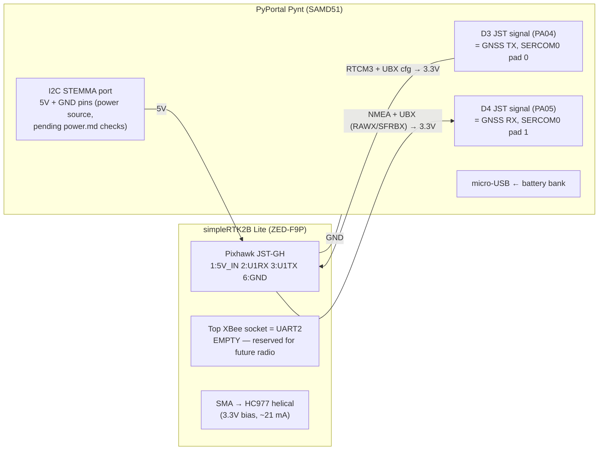

# Full-System Wiring — Pynt ↔ simpleRTK2B Lite

Only **four conductors** connect the two boards (power, TX, RX, ground) —
the Feather build's parallel tap and status link are gone; the Pynt does
everything on one MCU.

**Inherited vendor facts (verified for the Feather build, unchanged):**

- The Lite has **no native USB** — its XBee-to-USB adapter is an FTDI
  bridge onto **UART1**, the same F9P port the Pynt uses. The Pixhawk JST,
  bottom XBee header, and "USB/u-center" are all one port
  ([hookup guide](https://www.ardusimple.com/simplertk2blite-hookup-guide/),
  [ArduSimple Q&A](https://www.ardusimple.com/question/xbee-to-usb-adapter-connection-to-simplertk2blite/)).
- JST-GH pinout, from the F9P's perspective: **1 = 5V_IN, 2 = UART1 RX
  (F9P input), 3 = UART1 TX (F9P output), 4/5 = NC, 6 = GND**. Pin 1 is
  the white square / printed "1" on the PCB; **never trust pigtail wire
  colors** ([Pixhawk cable notes](https://www.ardusimple.com/product/pixhawk-cable-set/)).
- No I2C pads on the Lite — UART1 is the only MCU data path.

## System diagram



## Wire list (every conductor)

| # | From | To | Signal | Level |
|---|---|---|---|---|
| 1 | Pynt 5 V source — **I2C STEMMA port 5 V pin** (primary candidate) or bank feed (fallback; decided in `power.md`) | Lite JST **pin 1** (5V_IN) | power | 5 V (Lite accepts 4.5–5.5 V) |
| 2 | Pynt **D3 JST signal pin** (PA04, UART TX) | Lite JST **pin 2** (F9P UART1 **RX**) | RTCM3 corrections + UBX config | 3.3 V |
| 3 | Lite JST **pin 3** (F9P UART1 **TX**) | Pynt **D4 JST signal pin** (PA05, UART RX) | NMEA + UBX (RAWX/SFRBX) | 3.3 V |
| 4 | Lite JST **pin 6** (GND) | Pynt GND (D3/D4 JST ground pin, or I2C port GND if it carries the power) | ground | 0 V |

Signal-integrity note: the Pynt's D3/D4 lines each pass through a **1 kΩ
series protection resistor + 3.6 V zener**
([pinouts](https://learn.adafruit.com/adafruit-pyportal/pinouts)). At
115200 baud (bit time 8.7 µs) into the F9P's high-impedance CMOS input the
RC formed with pin capacitance is nanoseconds — no effect. Don't raise the
baud past 230400 without re-checking edges on a scope.

## ⚠ D3/D4 label-swap check (do this before wiring the Lite)

Forum reports say the **Pynt's D3/D4 silkscreen is swapped** vs. the
classic PyPortal ([Adafruit forums](https://forums.adafruit.com/viewtopic.php?t=168933)).
Procedure (Phase 1 bring-up sketch has this test):

1. Jumper the two JST **signal** pins together (D3 socket ↔ D4 socket).
2. Run the UART loopback test: firmware TXs a known pattern on the
   SERCOM0 UART and checks RX echo.
3. If loopback passes, remove the jumper, then run the "which socket is
   TX?" probe: firmware idles TX high and pulses it once per second;
   a multimeter/scope on each socket identifies the physical TX socket.
4. **Label both sockets with tape** per the measurement. Only then wire
   the Lite (its RX ← our measured TX).

Wrong guess consequence: harmless (both ends are 3.3 V UARTs and the
Pynt's pins are series-protected) — it just won't talk. But finding that
out *after* the enclosure is built is why we tape-label now.

## UART recipe (Arduino / Adafruit SAMD core)

Arduino pins 3/4 = PA04/PA05, `PIO_SERCOM_ALT` capable
([variant.cpp](https://github.com/adafruit/ArduinoCore-samd/blob/master/variants/pyportal_m4/variant.cpp)).
PA04 = SERCOM0/PAD[0] (ALT), PA05 = SERCOM0/PAD[1] (ALT); SAMD51 UART TX
must sit on pad 0 → **TX = D3, RX = D4**:

```cpp
Uart SerialGNSS(&sercom0, /*RX*/ 4, /*TX*/ 3,
                SERCOM_RX_PAD_1, UART_TX_PAD_0);
// SAMD51 SERCOMs have four IRQ lines — all must be forwarded:
void SERCOM0_0_Handler() { SerialGNSS.IrqHandler(); }
void SERCOM0_1_Handler() { SerialGNSS.IrqHandler(); }
void SERCOM0_2_Handler() { SerialGNSS.IrqHandler(); }
void SERCOM0_3_Handler() { SerialGNSS.IrqHandler(); }
// after SerialGNSS.begin(115200):
pinPeripheral(3, PIO_SERCOM_ALT);
pinPeripheral(4, PIO_SERCOM_ALT);
```

SERCOM budget (from
[variant.cpp](https://github.com/adafruit/ArduinoCore-samd/blob/master/variants/pyportal_m4/variant.cpp)):
SERCOM2 = SPI (AirLift + microSD), SERCOM4 = `Serial1`/`SerialNina`
(ESP32 boot/BLE serial — **do not repurpose**), SERCOM5 = Wire (I2C
STEMMA). **Free: SERCOM0 (ours), SERCOM1, SERCOM3.** Note SERCOM1's pads
(PA16–PA19) are physically consumed by the TFT's 8-bit data bus, so
SERCOM3 is the only real spare. Pad math is from the SAMD51 datasheet mux
table — the Phase 1 loopback is the ground-truth verification.

## NEVER-connect list (one driver per line)

1. **XBee-to-USB adapter + JST pigtail simultaneously.** The adapter's
   FTDI is a second driver on F9P UART1 RX. u-center sessions happen with
   the pigtail unplugged (or wire 2 detached). Multiple *power* sources
   are sanctioned by ArduSimple; the prohibition is **data contention**.
2. **Top XBee socket stays empty** — UART2 is the future radio's. Its
   VCC pin is a 3.3 V/250 mA *output*; never feed power in.
3. **Do not power the Lite from a Pynt 3.3 V pin.** The Lite regulates
   its own 3.3 V from 5V_IN; the Pynt's 3.3 V rail already carries the
   SAMD51 + TFT + AirLift (see `power.md`).
4. **D3/D4 JST power pins: connect nothing until measured** (`power.md`
   check P1) — their voltage is undocumented.
